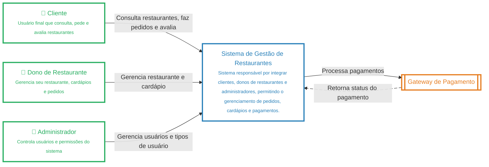
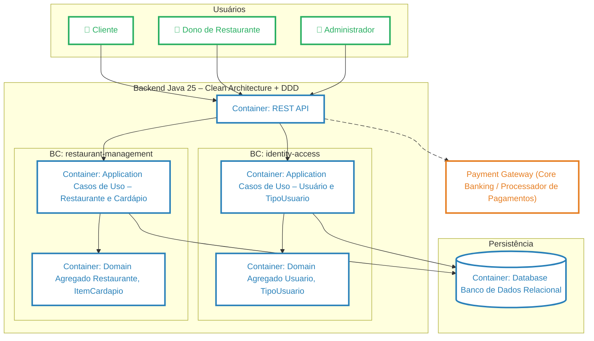

## C4 Model – Visão Arquitetural

### Nível 1 – System Context

```mermaid
flowchart LR

    %% --- Nós principais -------------------------------------------------------------
    cliente["👤 Cliente<br/><span style='font-size:12px'>Usuário final que consulta, pede e avalia restaurantes</span>"]
    dono["👤 Dono de Restaurante<br/><span style='font-size:12px'>Gerencia seu restaurante, cardápios e pedidos</span>"]
    admin["👤 Administrador<br/><span style='font-size:12px'>Controla usuários e permissões do sistema</span>"]

    sgr["Sistema de Gestão de Restaurantes<br/><span style='font-size:12px'>Sistema responsável por integrar clientes, donos de restaurantes e administradores, permitindo o gerenciamento de pedidos, cardápios e pagamentos.</span>"]

    paymentGw[[Gateway de Pagamento]]

    %% --- Relações -------------------------------------------------------------------
    cliente -->|Consulta restaurantes, faz pedidos e avalia| sgr
    dono -->|Gerencia restaurante e cardápio| sgr
    admin -->|Gerencia usuários e tipos de usuário| sgr

    sgr -->|Processa pagamentos| paymentGw
    paymentGw -.->|Retorna status do pagamento| sgr

    %% --- Estilos --------------------------------------------------------------------
    %% Pessoas (verde)
    classDef person fill:#ffffff,stroke:#27ae60,stroke-width:3px,color:#27ae60;

    %% Sistema principal (azul)
    classDef system fill:#ffffff,stroke:#2980b9,stroke-width:3px,color:#2980b9;

    %% Sistema externo (laranja)
    classDef externalOrange fill:#ffffff,stroke:#e67e22,stroke-width:3px,color:#e67e22;

    %% Seta tracejada
    classDef dashed stroke-dasharray: 8 4;

    %% --- Aplicação dos estilos ------------------------------------------------------
    class cliente,dono,admin person;
    class sgr system;
    class paymentGw externalOrange;

    %% Aplicar estilo tracejado nas setas externas
    linkStyle 4 stroke-dasharray:8 4;
```

### 2.2. Nível 2 – Containers

```mermaid
flowchart TB
    %% ===================== Usuários =====================
    subgraph Users [Usuários]
        cliente["👤 Cliente"]
        dono["👤 Dono de Restaurante"]
        admin["👤 Administrador"]
    end

    %% ===================== Backend ======================
    subgraph Backend [Backend Java 25 – Clean Architecture + DDD]
        api["Container: REST API"]

        subgraph BC_Identity [BC: identity-access]
            ia_app["Container: Application Casos de Uso – Usuário e TipoUsuario"]
            ia_domain["Container: Domain Agregado Usuario, TipoUsuario"]
        end

        subgraph BC_Restaurant [BC: restaurant-management]
            rm_app["Container: Application Casos de Uso – Restaurante e Cardápio"]
            rm_domain["Container: Domain Agregado Restaurante, ItemCardapio"]
        end
    end

    %% ===================== Persistência ==================
    subgraph Storage [Persistência]
        db[(Container: Database Banco de Dados Relacional)]
    end

    %% ===================== Sistemas externos =============
    paymentGw["Payment Gateway (Core Banking / Processador de Pagamentos)"]

    %% ===================== Fluxos ========================
    cliente --> api
    dono --> api
    admin --> api

    api --> ia_app
    api --> rm_app

    ia_app --> ia_domain
    rm_app --> rm_domain

    ia_app --> db
    rm_app --> db

    api --> paymentGw

    %% ===================== Estilos =======================
    %% Person (verde)
    classDef person fill:#ffffff,stroke:#27ae60,stroke-width:3px,color:#27ae60;

    %% Containers internos (azul)
    classDef container fill:#ffffff,stroke:#2980b9,stroke-width:3px,color:#2980b9;

    %% Database container (azul)
    classDef db fill:#ffffff,stroke:#2980b9,stroke-width:3px,color:#2980b9;

    %% Sistemas externos – payment (laranja)
    classDef externalOrange fill:#ffffff,stroke:#e67e22,stroke-width:3px,color:#e67e22;

    %% Estilo para links tracejados
    classDef dashed stroke-dasharray: 8 4;

    %% Aplicação das classes
    class cliente,dono,admin person;
    class api,ia_app,ia_domain,rm_app,rm_domain container;
    class db db;
    class paymentGw externalOrange;

    %% Relação externa tracejada (ajustada índice)
    linkStyle 9 stroke-dasharray:8 4;
```
